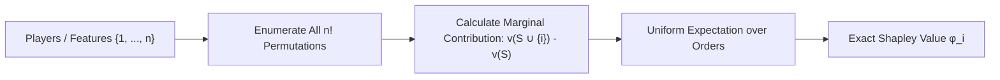

# Shapley Value Cooperative Game Attribution Skill

Axiomatically unique payoff allocation and feature importance engine based on coalitional marginal contribution averaging.

## Features
- **100% Python Standard Library**: Exact permutation evaluation.
- **Axiomatic Fairness**: Strictly satisfies Efficiency, Symmetry, Additivity, and Null Player axioms.
- **Universal Application**: Powers team profit division, cost sharing, and machine learning feature attribution.
